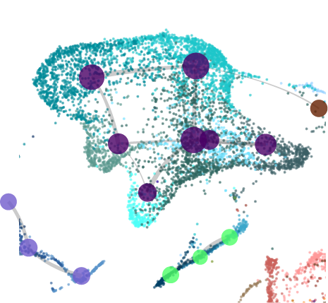
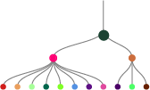

A collection of notebooks to recreate some of the analyses and visualizations created by using the srattch suite of tools.

## Visualizations 

[**UMAP plotting using scrattch**](scrattch.umap.html): An example for plotting a hierarchical tree (not dendrogram!) based on result from hierarchical clustering.

[**Constellation plot**](scrattch.umap.html): An example for plotting a hierarchical tree (not dendrogram!) based on result from hierarchical clustering.

[**HierTree**](HierTree.html): An example for plotting a hierarchical tree (not dendrogram!) based on result from hierarchical clustering.

[**Gene expression dotplot**](GE_dotplot.html): An example for plotting a hierarchical tree (not dendrogram!) based on result from hierarchical clustering.

[**Spatial Tx plotting**](merfish.plot.html): An example for plotting a hierarchical tree (not dendrogram!) based on result from hierarchical clustering.

