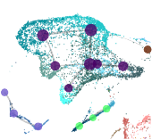
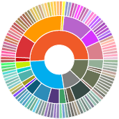

A collection of notebooks to recreate some of the analyses and visualizations created by using the srattch suite of tools.

## Visualizations

\
\

[**Constellation**](Constellation.html): An example for plotting a constellation plot.

\
\

[**HierTree**](HierTree.html): An example for plotting a hierarchical tree (not dendrogram!) based on result from hierarchical clustering.

\
\

[**Sunburst**](Sunburst.html): An example for plotting a sunburst diagram based on result from hierarchical clustering.

\
\
